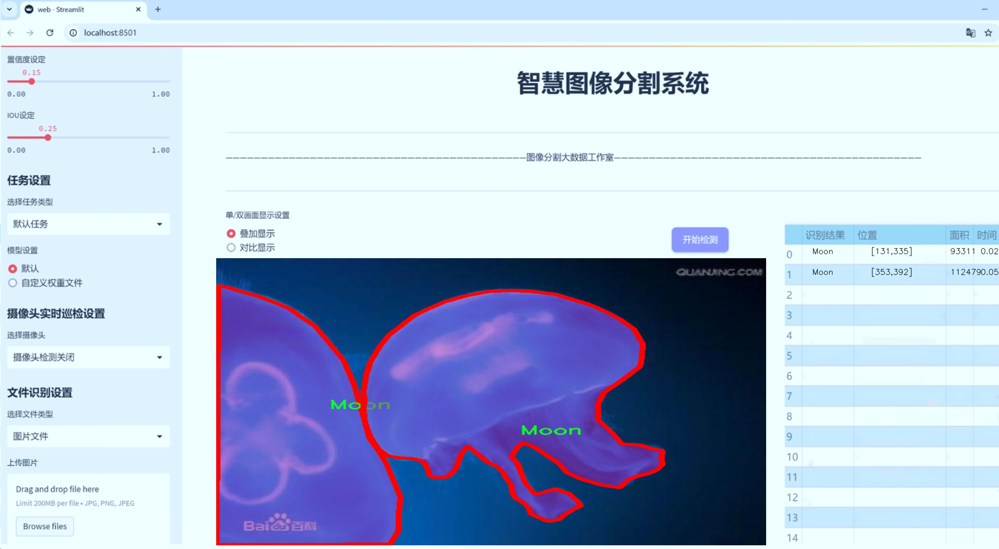
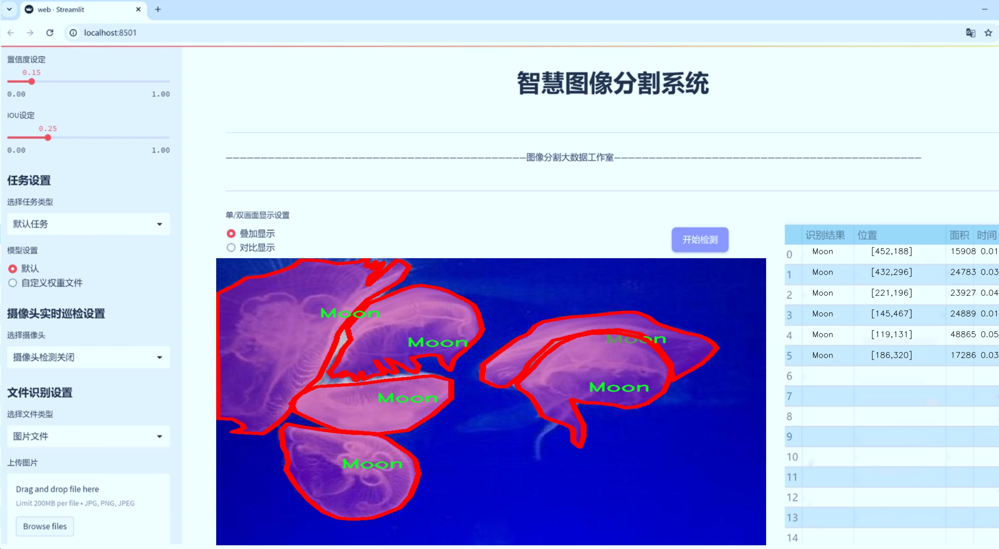
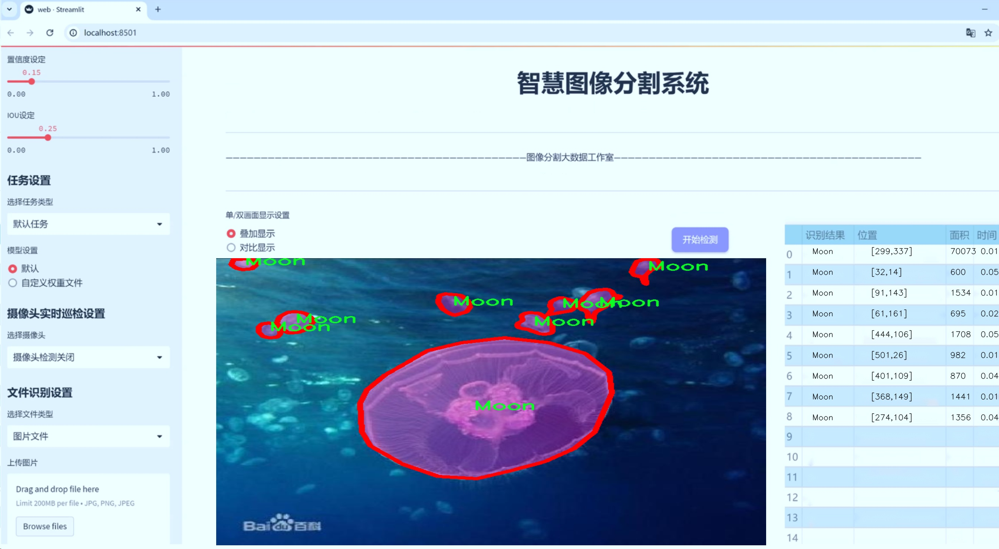
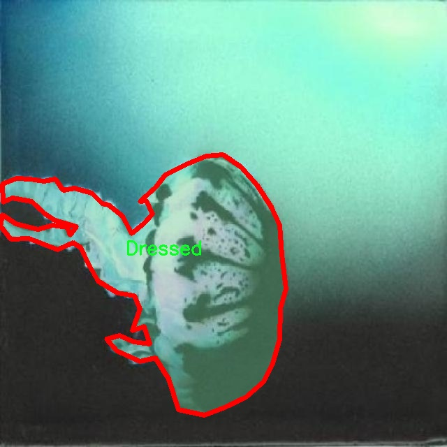
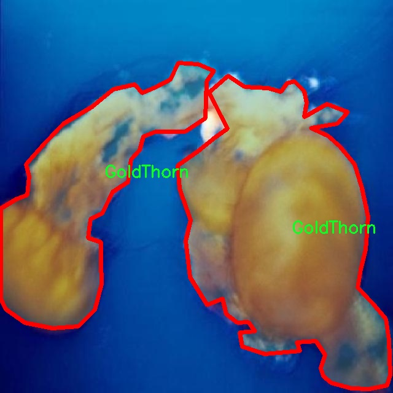
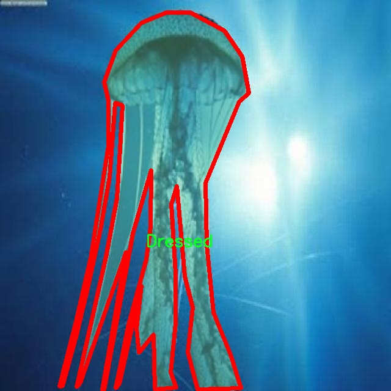
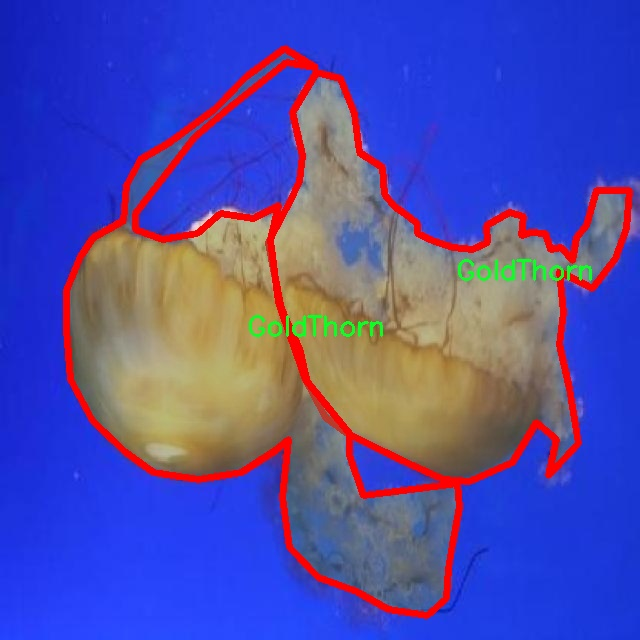
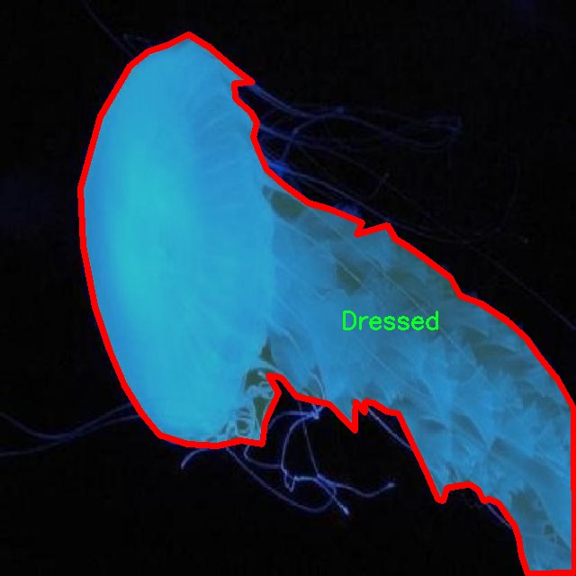

# 水母图像分割系统： yolov8-seg-rtdetr

### 1.研究背景与意义

[参考博客](https://gitee.com/YOLOv8_YOLOv11_Segmentation_Studio/projects)

[博客来源](https://kdocs.cn/l/cszuIiCKVNis)

研究背景与意义

水母作为海洋生态系统中重要的生物，其独特的形态和生物特性吸引了众多研究者的关注。随着海洋环境变化和人类活动的影响，水母的种群数量和分布模式发生了显著变化，导致其在生态系统中的角色愈发重要。水母不仅是海洋食物链的重要组成部分，还对海洋生态平衡、渔业资源和人类活动产生深远影响。因此，准确识别和分割水母图像，对于理解其生态行为、监测种群动态以及评估其对环境变化的响应具有重要的科学意义。

在图像处理和计算机视觉领域，目标检测和图像分割技术的快速发展为水母的研究提供了新的工具和方法。YOLO（You Only Look Once）系列模型以其高效的实时检测能力和良好的准确性，成为了目标检测领域的热门选择。YOLOv8作为该系列的最新版本，结合了深度学习的先进技术，具有更高的检测精度和更快的处理速度。然而，针对水母这一特定对象的图像分割任务，YOLOv8仍存在一定的局限性，尤其是在处理复杂背景和多种类水母时，分割效果不尽如人意。因此，基于改进YOLOv8的水母图像分割系统的研究显得尤为重要。

本研究所使用的数据集包含3100幅水母图像，涵盖了13个不同的类别，包括Comb、Dressed、Fish、FriedEggs、GoldThorn、Handstand、LightHouse、LionMane、Moon、Mosaic、Saltpeter、Speckle和StarThorn。这些类别的多样性为模型的训练和评估提供了丰富的样本，能够有效提高模型的泛化能力和鲁棒性。通过对这些图像进行实例分割，可以实现对不同水母种类的精确识别和分离，从而为后续的生态研究提供可靠的数据支持。

此外，改进YOLOv8的水母图像分割系统的研究不仅具有学术价值，也具备广泛的应用前景。该系统可以应用于海洋监测、生态保护、渔业管理等多个领域，帮助研究人员和管理者实时获取水母的分布信息和种群动态，为制定科学的管理策略提供依据。同时，该研究也为计算机视觉领域的实例分割技术提供了新的思路和方法，推动了相关技术的进步。

综上所述，基于改进YOLOv8的水母图像分割系统的研究，不仅能够提升水母的识别和分割精度，促进海洋生态研究的深入开展，还将为计算机视觉技术在生物识别领域的应用提供重要的实践经验。通过本研究的开展，期望能够为水母的生态监测和保护提供有效的技术支持，推动海洋科学的可持续发展。

### 2.图片演示







注意：本项目提供完整的训练源码数据集和训练教程,由于此博客编辑较早,暂不提供权重文件（best.pt）,需要按照6.训练教程进行训练后实现上图效果。

### 3.视频演示

[3.1 视频演示](https://www.bilibili.com/video/BV1mfzbYYEGV/)

### 4.数据集信息

##### 4.1 数据集类别数＆类别名

nc: 13
names: ['Comb', 'Dressed', 'Fish', 'FriedEggs', 'GoldThorn', 'Handstand', 'LightHouse', 'LionMane', 'Moon', 'Mosaic', 'Saltpeter', 'Speckle', 'StarThorn']


##### 4.2 数据集信息简介

数据集信息展示

在本研究中，我们使用了名为“Jellyfish”的数据集，以训练和改进YOLOv8-seg模型，旨在实现高效的水母图像分割。该数据集包含13个不同的类别，每个类别代表了水母及其相关生物的独特特征和形态。这些类别包括：Comb（梳状水母）、Dressed（着装水母）、Fish（鱼类）、FriedEggs（煎蛋水母）、GoldThorn（金刺水母）、Handstand（倒立水母）、LightHouse（灯塔水母）、LionMane（狮鬃水母）、Moon（月亮水母）、Mosaic（马赛克水母）、Saltpeter（硝石水母）、Speckle（斑点水母）和StarThorn（星刺水母）。这些类别的多样性不仅反映了水母的生物多样性，也为模型的训练提供了丰富的样本，使其能够更好地识别和分割不同类型的水母。

数据集中的每个类别都包含大量高质量的图像，这些图像经过精心标注，确保了训练过程中的准确性和有效性。通过对这些图像的分析，YOLOv8-seg模型能够学习到不同水母的形态特征和颜色变化，从而在实际应用中实现更高的分割精度。例如，梳状水母以其独特的梳状结构而闻名，而狮鬃水母则因其长长的触手而引人注目。通过对这些特征的学习，模型不仅能够识别出水母的种类，还能在复杂的水下环境中进行有效的分割。

此外，数据集中的图像涵盖了多种拍摄条件和背景，这使得模型在训练过程中能够适应不同的环境变化。例如，某些图像可能是在阳光明媚的日子拍摄的，而另一些则可能是在阴暗的水域中拍摄的。这种多样性有助于提高模型的鲁棒性，使其在面对不同光照和背景条件时仍能保持良好的性能。

在训练过程中，我们将数据集分为训练集和验证集，以确保模型的泛化能力。训练集用于模型的学习，而验证集则用于评估模型在未见数据上的表现。通过不断调整模型参数和优化算法，我们期望能够提高YOLOv8-seg在水母图像分割任务中的表现，最终实现高效、准确的水母检测和分割。

总之，“Jellyfish”数据集为本研究提供了丰富的图像资源和多样的类别选择，使得YOLOv8-seg模型能够在水母图像分割任务中发挥出色的性能。通过对这些数据的深入分析和学习，我们希望能够推动水下生物图像处理技术的发展，为未来的海洋研究和生态保护提供更为强大的工具。











### 5.项目依赖环境部署教程（零基础手把手教学）

[5.1 环境部署教程链接（零基础手把手教学）](https://www.bilibili.com/video/BV1jG4Ve4E9t/?vd_source=bc9aec86d164b67a7004b996143742dc)


[5.2 安装Python虚拟环境创建和依赖库安装视频教程链接（零基础手把手教学）](https://www.bilibili.com/video/BV1nA4VeYEze/?vd_source=bc9aec86d164b67a7004b996143742dc)

### 6.手把手YOLOV8-seg训练视频教程（零基础手把手教学）

[6.1 手把手YOLOV8-seg训练视频教程（零基础小白有手就能学会）](https://www.bilibili.com/video/BV1cA4VeYETe/?vd_source=bc9aec86d164b67a7004b996143742dc)


按照上面的训练视频教程链接加载项目提供的数据集，运行train.py即可开始训练



     Epoch   gpu_mem       box       obj       cls    labels  img_size
     1/200     0G   0.01576   0.01955  0.007536        22      1280: 100%|██████████| 849/849 [14:42<00:00,  1.04s/it]
               Class     Images     Labels          P          R     mAP@.5 mAP@.5:.95: 100%|██████████| 213/213 [01:14<00:00,  2.87it/s]
                 all       3395      17314      0.994      0.957      0.0957      0.0843

     Epoch   gpu_mem       box       obj       cls    labels  img_size
     2/200     0G   0.01578   0.01923  0.007006        22      1280: 100%|██████████| 849/849 [14:44<00:00,  1.04s/it]
               Class     Images     Labels          P          R     mAP@.5 mAP@.5:.95: 100%|██████████| 213/213 [01:12<00:00,  2.95it/s]
                 all       3395      17314      0.996      0.956      0.0957      0.0845

     Epoch   gpu_mem       box       obj       cls    labels  img_size
     3/200     0G   0.01561    0.0191  0.006895        27      1280: 100%|██████████| 849/849 [10:56<00:00,  1.29it/s]
               Class     Images     Labels          P          R     mAP@.5 mAP@.5:.95: 100%|███████   | 187/213 [00:52<00:00,  4.04it/s]
                 all       3395      17314      0.996      0.957      0.0957      0.0845


### 7.50+种全套YOLOV8-seg创新点加载调参实验视频教程（一键加载写好的改进模型的配置文件）

[7.1 50+种全套YOLOV8-seg创新点加载调参实验视频教程（一键加载写好的改进模型的配置文件）](https://www.bilibili.com/video/BV1Hw4VePEXv/?vd_source=bc9aec86d164b67a7004b996143742dc)

### YOLOV8-seg算法简介

原始YOLOV8-seg算法原理

YOLOv8-seg是Ultralytics公司在2023年推出的YOLO系列最新算法，标志着目标检测和图像分割领域的又一次重要进步。该算法不仅延续了YOLO系列一贯的高效性和准确性，还在多个方面进行了创新和改进，特别是在特征提取、特征融合和损失函数的设计上。YOLOv8-seg的核心在于其采用的C2f模块、PAN-FPN结构以及Anchor-Free检测方式，这些创新使得YOLOv8-seg在处理复杂场景时表现出色。

首先，YOLOv8-seg的主干网络采用了CSP结构，将特征提取过程分为两个部分，分别进行卷积和连接。这一设计不仅提高了特征提取的效率，还有效缓解了深层网络中的梯度消失问题。C2f模块的引入是YOLOv8-seg的一大亮点。C2f模块基于YOLOv5的C3模块和YOLOv7的ELAN思想，具有两个分支结构，其中一个分支直接将特征图送入Concat层，另一个分支则通过多个Bottleneck网络进行串并联输出。这种设计允许网络在提取特征时，能够同时利用短路径和长路径的梯度信息，从而增强了特征的重用性和丰富性。

在特征融合方面，YOLOv8-seg采用了PAN-FPN结构，这一结构能够有效地实现多尺度特征的融合。PAN-FPN的设计理念是通过自下而上的特征融合和自上而下的特征传递，使得不同层次的特征能够在保持语义信息的同时，获得更高的空间分辨率。这一过程通过将高层特征进行上采样后与中层特征进行Concat操作，确保了细节信息与语义信息的充分结合，从而提升了目标检测的准确性。

YOLOv8-seg的检测网络采用了Anchor-Free的方式，这一创新使得模型在处理不同尺度和形状的目标时更加灵活。传统的Anchor-Based方法在面对多样化的目标时往往需要手动设计锚框，而YOLOv8-seg通过解耦头结构，将分类和回归任务分开处理，简化了模型的设计和训练过程。这种解耦设计不仅提高了模型的训练效率，还增强了其在复杂场景下的适应能力。

在损失函数的设计上，YOLOv8-seg使用了VFLLoss和DFLLoss+CIoULoss的组合，这一组合不仅能够有效地处理分类和回归任务的损失，还能够在样本不平衡的情况下提升模型的学习能力。特别是在处理小目标时，Focal Loss的引入使得模型能够更加关注难以分类的样本，从而提高了整体的检测精度。

YOLOv8-seg在数据预处理方面也进行了创新，采用了包括马赛克增强、混合增强、空间扰动和颜色扰动等多种数据增强手段。这些增强手段不仅提高了模型的鲁棒性，还在一定程度上缓解了过拟合的问题。通过对输入图像进行640x640的RGB转换，YOLOv8-seg能够在保持高分辨率的同时，充分利用网络的特征提取能力。

总的来说，YOLOv8-seg算法通过对主干网络、特征融合、检测方式和损失函数的全面改进，展现了其在目标检测和图像分割任务中的强大能力。其创新的C2f模块和PAN-FPN结构使得模型在特征提取和融合方面表现出色，而Anchor-Free的检测方式则为处理复杂场景提供了更大的灵活性。此外，结合多种数据增强手段和高效的损失函数设计，YOLOv8-seg在提升检测精度的同时，也确保了模型的高效性和实用性。这些特性使得YOLOv8-seg成为当前目标检测和图像分割领域的一个重要工具，具有广泛的应用前景。


### 9.系统功能展示（检测对象为举例，实际内容以本项目数据集为准）

图9.1.系统支持检测结果表格显示

  图9.2.系统支持置信度和IOU阈值手动调节

  图9.3.系统支持自定义加载权重文件best.pt(需要你通过步骤5中训练获得)

  图9.4.系统支持摄像头实时识别

  图9.5.系统支持图片识别

  图9.6.系统支持视频识别

  图9.7.系统支持识别结果文件自动保存

  图9.8.系统支持Excel导出检测结果数据


### 10.50+种全套YOLOV8-seg创新点原理讲解（非科班也可以轻松写刊发刊，V11版本正在科研待更新）

#### 10.1 由于篇幅限制，每个创新点的具体原理讲解就不一一展开，具体见下列网址中的创新点对应子项目的技术原理博客网址【Blog】：


[10.1 50+种全套YOLOV8-seg创新点原理讲解链接](https://gitee.com/qunmasj/good)

#### 10.2 部分改进模块原理讲解(完整的改进原理见上图和技术博客链接)【如果此小节的图加载失败可以通过CSDN或者Github搜索该博客的标题访问原始博客，原始博客图片显示正常】

### YOLOv8模型
YOLOv8模型由Ultralytics团队在YOLOv5模型的基础上，吸收了近两年半来经过实际验证的各种改进，于2023年1月提出。与之前的一些YOLO 系列模型想类似，YOLOv8模型也有多种尺寸，下面以YOLOv8n为例，分析 YOLOv8模型的结构和改进点。YOLOv8模型网络结构如
输入图片的部分，由于发现Mosaic数据增强尽管这有助于提升模型的鲁棒性和泛化性，但是，在一定程度上，也会破坏数据的真实分布，使得模型学习到一些不好的信息。所以YOLOv8模型在训练中的最后10个epoch 停止使用Mosaic数据增强。


在网络结构上，首先主干网络的改变不大，主要是将C3模块替换为了C2f模块，该模块的结构在上图中已示出。C2f模块在C3模块的思路基础上，引入了YOLOv7中 ELAN的思路，引入了更多的跳层连接，这有助于该模块获得更丰富的梯度流信息，而且模型的轻量化得到了保证。依然保留了SPPF，效果不变的同时减少了该模块的执行时间。
在颈部网络中，也是将所有的C3模块更改为C2f模块，同时删除了两处上采样之前的卷积连接层。
在头部网络中，采用了YOLOX中使用的解耦头的思路，两条并行的分支分别提取类别和位置特征。由于分类任务更注重于分析特征图中提取到的特征与已输入图片的部分，由于发现 Mosaic数据增强尽管这有助于提升模型的鲁棒性和泛化性，但是，在一定程度上，也会破坏数据的真实分布，使得模型学习到一些不好的信息。所以YOLOv8模型在训练中的最后10个epoch停止使用Mosaic数据增强。
在网络结构上，首先主干网络的改变不大，主要是将C3模块替换为了C2f模块，该模块的结构在上图中已示出。C2f模块在C3模块的思路基础上，引入了YOLOv7中ELAN的思路，引入了更多的跳层连接，这有助于该模块获得更丰富的梯度流信息，而且模型的轻量化得到了保证。依然保留了SPPF，效果不变的同时减少了该模块的执行时间。
在颈部网络中，也是将所有的C3模块更改为C2f模块，同时删除了两处上采样之前的卷积连接层。
在头部网络中，采用了YOLOX中使用的解耦头的思路，两条并行的分支分别提取类别和位置特征。由于分类任务更注重于分析特征图中提取到的特征与已有类别中的哪一种更为相似，而定位任务更关注边界框与真值框的位置关系，并据此对边界框的坐标进行调整。侧重点的不同使得在使用两个检测头时收敛的速度和预测的精度有所提高。而且使用了无锚框结构，直接预测目标的中心，并使用TAL (Task Alignment Learning，任务对齐学习）来区分正负样本，引入了分类分数和IOU的高次幂乘积作为衡量任务对齐程度的指标，认为同时拥有好的定位和分类评价的在分类和定位损失函数中也引入了这项指标。
在模型的检测结果上，YOLOv8模型也取得了较好的成果，图为官方在coCO数据集上 YOLOv8模型的模型尺寸大小和检测的mAP50-95对比图。mAP50-95指的是IOU的值从50%取到95%，步长为5%，然后算在这些IOU下的mAP的均值。图的 a）图展示了YOLOv8在同尺寸下模型中参数没有较大增加的前提下取得了比其他模型更好的精度，图2-17的b)图展示了YOLOv8比其他YOLO系列模型在同尺寸时，推理速度更快且精度没有太大下降。


### 视觉transformer(ViT)简介
视觉transformer(ViT)最近在各种计算机视觉任务中证明了巨大的成功，并受到了相当多的关注。与卷积神经网络(CNNs)相比，ViT具有更强的全局信息捕获能力和远程交互能力，表现出优于CNNs的准确性，特别是在扩大训练数据大小和模型大小时[An image is worth 16x16 words: Transformers for image recognition at scale,Coatnet]。

尽管ViT在低分辨率和高计算领域取得了巨大成功，但在高分辨率和低计算场景下，ViT仍不如cnn。例如，下图(左)比较了COCO数据集上当前基于cnn和基于vit的一级检测器。基于vit的检测器(160G mac)和基于cnn的检测器(6G mac)之间的效率差距超过一个数量级。这阻碍了在边缘设备的实时高分辨率视觉应用程序上部署ViT。


左图:现有的基于vit的一级检测器在实时目标检测方面仍然不如当前基于cnn的一级检测器，需要的计算量多出一个数量级。本文引入了第一个基于vit的实时对象检测器来弥补这一差距。在COCO上，efficientvit的AP比efficientdet高3.8，而mac较低。与YoloX相比，efficient ViT节省67.2%的计算成本，同时提供更高的AP。

中:随着输入分辨率的增加，计算成本呈二次增长，无法有效处理高分辨率的视觉应用。

右图:高分辨率对图像分割很重要。当输入分辨率从1024x2048降低到512x1024时，MobileNetV2的mIoU减少12% (8.5 mIoU)。在不提高分辨率的情况下，只提高模型尺寸是无法缩小性能差距的。

ViT的根本计算瓶颈是softmax注意模块，其计算成本随输入分辨率的增加呈二次增长。例如，如上图(中)所示，随着输入分辨率的增加，vit- small[Pytorch image models. https://github.com/rwightman/ pytorch-image-models]的计算成本迅速显著大于ResNet-152的计算成本。

解决这个问题的一个直接方法是降低输入分辨率。然而，高分辨率的视觉识别在许多现实世界的计算机视觉应用中是必不可少的，如自动驾驶，医疗图像处理等。当输入分辨率降低时，图像中的小物体和精细细节会消失，导致目标检测和语义分割性能显著下降。

上图(右)显示了在cityscape数据集上不同输入分辨率和宽度乘法器下MobileNetV2的性能。例如，将输入分辨率从1024x2048降低到512x1024会使cityscape的性能降低12% (8.5 mIoU)。即使是3.6倍高的mac，只放大模型尺寸而不增加分辨率也无法弥补这一性能损失。

除了降低分辨率外，另一种代表性的方法是限制softmax注意，方法是将其范围限制在固定大小的局部窗口内[Swin transformer,Swin transformer v2]或降低键/值张量的维数[Pyramid vision transformer,Segformer]。然而，它损害了ViT的非局部注意能力，降低了全局接受域(ViT最重要的优点)，使得ViT与大内核cnn的区别更小[A convnet for the 2020s,Scaling up your kernels to 31x31: Revisiting large kernel design in cnns,Lite pose: Efficient architecture design for 2d human pose estimation]。

本文介绍了一个有效的ViT体系结构，以解决这些挑战。发现没有必要坚持softmax注意力。本文建议用线性注意[Transformers are rnns: Fast autoregressive transformers with linear attention]代替softmax注意。

线性注意的关键好处是，它保持了完整的n 2 n^2n 2
 注意映射，就像softmax注意。同时，它利用矩阵乘法的联想特性，避免显式计算完整的注意映射，同时保持相同的功能。因此，它保持了softmax注意力的全局特征提取能力，且计算复杂度仅为线性。线性注意的另一个关键优点是它避免了softmax，这使得它在移动设备上更有效(下图左)。


左图:线性注意比类似mac下的softmax注意快3.3-4.5倍，这是因为去掉了硬件效率不高的softmax功能。延迟是在Qualcomm Snapdragon 855 CPU和TensorFlow-Lite上测量的。本文增加线性注意的头部数量，以确保它具有与softmax注意相似的mac。

中:然而，如果没有softmax注意中使用的非线性注意评分归一化，线性注意无法有效集中其注意分布，削弱了其局部特征提取能力。后文提供了可视化。

右图:本文用深度卷积增强线性注意，以解决线性注意的局限性。深度卷积可以有效地捕捉局部特征，而线性注意可以专注于捕捉全局信息。增强的线性注意在保持线性注意的效率和简单性的同时，表现出在各种视觉任务上的强大表现(图4)。

然而，直接应用线性注意也有缺点。以往的研究表明线性注意和softmax注意之间存在显著的性能差距(下图中间)。


左:高通骁龙855上的精度和延迟权衡。效率vit比效率网快3倍，精度更高。中:ImageNet上softmax注意与线性注意的比较。在相同的计算条件下，本文观察到softmax注意与线性注意之间存在显著的精度差距。而深度卷积增强模型后，线性注意的精度有明显提高。

相比之下，softmax注意的精度变化不大。在相同MAC约束下，增强线性注意比增强软最大注意提高了0.3%的精度。右图:与增强的softmax注意相比，增强的线性注意硬件效率更高，随着分辨率的增加，延迟增长更慢。

深入研究线性注意和softmax注意的详细公式，一个关键的区别是线性注意缺乏非线性注意评分归一化方案。这使得线性注意无法有效地将注意力分布集中在局部模式产生的高注意分数上，从而削弱了其局部特征提取能力。

本文认为这是线性注意的主要限制，使其性能不如softmax注意。本文提出了一个简单而有效的解决方案来解决这一限制，同时保持线性注意在低复杂度和低硬件延迟方面的优势。具体来说，本文建议通过在每个FFN层中插入额外的深度卷积来增强线性注意。因此，本文不需要依赖线性注意进行局部特征提取，避免了线性注意在捕捉局部特征方面的不足，并利用了线性注意在捕捉全局特征方面的优势。

本文广泛评估了efficient vit在低计算预算下对各种视觉任务的有效性，包括COCO对象检测、城市景观语义分割和ImageNet分类。本文想要突出高效的主干设计，所以没有包括任何正交的附加技术(例如，知识蒸馏，神经架构搜索)。尽管如此，在COCO val2017上，efficientvit的AP比efficientdet - d1高2.4倍，同时节省27.9%的计算成本。在cityscape上，efficientvit提供了比SegFormer高2.5个mIoU，同时降低了69.6%的计算成本。在ImageNet上，efficientvit在584M mac上实现了79.7%的top1精度，优于efficientnet - b1的精度，同时节省了16.6%的计算成本。

与现有的以减少参数大小或mac为目标的移动ViT模型[Mobile-former,Mobilevit,NASVit]不同，本文的目标是减少移动设备上的延迟。本文的模型不涉及复杂的依赖或硬件低效操作。因此，本文减少的计算成本可以很容易地转化为移动设备上的延迟减少。

在高通骁龙855 CPU上，efficient vit运行速度比efficientnet快3倍，同时提供更高的ImageNet精度。本文的代码和预训练的模型将在出版后向公众发布。

### Efficient Vision Transformer.
提高ViT的效率对于在资源受限的边缘平台上部署ViT至关重要，如手机、物联网设备等。尽管ViT在高计算区域提供了令人印象深刻的性能，但在针对低计算区域时，它通常不如以前高效的cnn[Efficientnet, mobilenetv3,Once for all: Train one network and specialize it for efficient deployment]。为了缩小差距，MobileViT建议结合CNN和ViT的长处，使用transformer将卷积中的局部处理替换为全局处理。MobileFormer提出了在MobileNet和Transformer之间建立双向桥以实现特征融合的并行化。NASViT提出利用神经架构搜索来搜索高效的ViT架构。

这些模型在ImageNet上提供了极具竞争力的准确性和效率的权衡。然而，它们并不适合高分辨率的视觉任务，因为它们仍然依赖于softmax注意力。


在本节中，本文首先回顾了自然语言处理中的线性注意，并讨论了它的优缺点。接下来，本文介绍了一个简单而有效的解决方案来克服线性注意的局限性。最后，给出了efficient vit的详细架构。

 为可学习投影矩阵。Oi表示矩阵O的第i行。Sim(·，·)为相似度函数。

虽然softmax注意力在视觉和NLP方面非常成功，但它并不是唯一的选择。例如，线性注意提出了如下相似度函数:


其中，φ(·)为核函数。在本工作中，本文选择了ReLU作为内核函数，因为它对硬件来说是友好的。当Sim(Q, K) = φ(Q)φ(K)T时，式(1)可改写为:


线性注意的一个关键优点是，它允许利用矩阵乘法的结合律，在不改变功能的情况下，将计算复杂度从二次型降低到线性型:


除了线性复杂度之外，线性注意的另一个关键优点是它不涉及注意模块中的softmax。Softmax在硬件上效率非常低。避免它可以显著减少延迟。例如，下图(左)显示了softmax注意和线性注意之间的延迟比较。在类似的mac上，线性注意力比移动设备上的softmax注意力要快得多。


#### EfficientViT
Enhancing Linear Attention with Depthwise Convolution

虽然线性注意在计算复杂度和硬件延迟方面优于softmax注意，但线性注意也有局限性。以往的研究[\[Luna: Linear unified nested attention,Random feature attention,Combiner: Full attention transformer with sparse computation cost,cosformer: Rethinking softmax in attention\]](https://afdian.net/item/602b9612927111ee9ec55254001e7c00)表明，在NLP中线性注意和softmax注意之间通常存在显著的性能差距。对于视觉任务，之前的研究[Visual correspondence hallucination,Quadtree attention for vision transformers]也表明线性注意不如softmax注意。在本文的实验中，本文也有类似的观察结果(图中)。


本文对这一假设提出了质疑，认为线性注意的低劣性能主要是由于局部特征提取能力的丧失。如果没有在softmax注意中使用的非线性评分归一化，线性注意很难像softmax注意那样集中其注意分布。下图(中间)提供了这种差异的示例。


在相同的原始注意力得分下，使用softmax比不使用softmax更能集中注意力。因此，线性注意不能有效地聚焦于局部模式产生的高注意分数(下图)，削弱了其局部特征提取能力。


注意图的可视化显示了线性注意的局限性。通过非线性注意归一化，softmax注意可以产生清晰的注意分布，如中间行所示。相比之下，线性注意的分布相对平滑，使得线性注意在捕捉局部细节方面的能力较弱，造成了显著的精度损失。本文通过深度卷积增强线性注意来解决这一限制，并有效提高了准确性。

介绍了一个简单而有效的解决方案来解决这个限制。本文的想法是用卷积增强线性注意，这在局部特征提取中是非常有效的。这样，本文就不需要依赖于线性注意来捕捉局部特征，而可以专注于全局特征提取。具体来说，为了保持线性注意的效率和简单性，本文建议在每个FFN层中插入一个深度卷积，这样计算开销很小，同时极大地提高了线性注意的局部特征提取能力。

#### Building Block

下图(右)展示了增强线性注意的详细架构，它包括一个线性注意层和一个FFN层，在FFN的中间插入深度卷积。


与之前的方法[Swin transformer,Coatnet]不同，本文在efficientvit中没有使用相对位置偏差。相对位置偏差虽然可以改善模型的性能，但它使模型容易受到分辨率变化[Segformer]的影响。多分辨率训练或新分辨率下的测试在检测和分割中很常见。去除相对位置偏差使高效率vit对输入分辨率更加灵活。

与之前低计算CNNs[Mobilenetv2,mobilenetv3]的设计不同，本文为下采样块添加了额外的下采样快捷方式。每个下采样快捷方式由一个平均池和一个1x1卷积组成。在本文的实验中，这些额外的下采样快捷方式可以稳定训练效率，提高性能。

#### Macro Architecture

下图说明了efficientvit的宏观体系结构。它由输入 stem 和4级组成。最近的研究[Coatnet,Levit,Early convolutions help transformers see better]表明在早期阶段使用卷积对ViT更好。本文遵循这个设计，在第三阶段开始使用增强的线性注意。


EfficientViT宏观架构。本文从第三阶段开始使用增强的线性注意。P2、P3和P4形成了一个金字塔特征图，用于检测和分割。P4用于分类。

为了突出高效的主干本身，本文对MBConv和FFN使用相同的扩展比e (e = 4)保持超参数简单，对所有深度卷积使用相同的内核大小k(除了输入stem)，对所有层使用相同的激活函数(hard swish)。

P2、P3和P4表示阶段2、3和4的输出，形成了特征图的金字塔。本文按照惯例将P2、P3和P4送至检测头。本文使用Yolov8进行检测。为了分割，本文融合了P2和P4。融合特征被馈送到一个轻量级头，包括几个卷积层，遵循Fast-SCNN。为了分类，本文将P4输入到轻量级头部，与MobileNetV3相同。


### 11.项目核心源码讲解（再也不用担心看不懂代码逻辑）

#### 11.1 ultralytics\models\sam\modules\tiny_encoder.py

以下是经过精简和注释的 TinyViT 模型代码，保留了最核心的部分，并对每个类和方法进行了详细的中文注释：

```python
import itertools
import torch
import torch.nn as nn
import torch.nn.functional as F
import torch.utils.checkpoint as checkpoint

class Conv2d_BN(torch.nn.Sequential):
    """执行2D卷积并随后进行批量归一化的序列容器。"""

    def __init__(self, in_channels, out_channels, kernel_size=1, stride=1, padding=0, dilation=1, groups=1, bn_weight_init=1):
        """初始化卷积层和批量归一化层。"""
        super().__init__()
        self.add_module('conv', torch.nn.Conv2d(in_channels, out_channels, kernel_size, stride, padding, dilation, groups, bias=False))
        bn = torch.nn.BatchNorm2d(out_channels)
        torch.nn.init.constant_(bn.weight, bn_weight_init)  # 初始化BN权重
        torch.nn.init.constant_(bn.bias, 0)  # 初始化BN偏置
        self.add_module('bn', bn)

class PatchEmbed(nn.Module):
    """将图像嵌入为补丁并投影到指定的嵌入维度。"""

    def __init__(self, in_chans, embed_dim, resolution, activation):
        """初始化补丁嵌入层。"""
        super().__init__()
        img_size = (resolution, resolution)  # 假设输入为正方形图像
        self.patches_resolution = (img_size[0] // 4, img_size[1] // 4)  # 计算补丁分辨率
        self.seq = nn.Sequential(
            Conv2d_BN(in_chans, embed_dim // 2, kernel_size=3, stride=2, padding=1),
            activation(),
            Conv2d_BN(embed_dim // 2, embed_dim, kernel_size=3, stride=2, padding=1),
        )

    def forward(self, x):
        """前向传播，将输入张量通过补丁嵌入层。"""
        return self.seq(x)

class MBConv(nn.Module):
    """移动反向瓶颈卷积层，EfficientNet架构的一部分。"""

    def __init__(self, in_chans, out_chans, expand_ratio, activation):
        """初始化MBConv层。"""
        super().__init__()
        self.conv1 = Conv2d_BN(in_chans, in_chans * expand_ratio, kernel_size=1)
        self.act1 = activation()
        self.conv2 = Conv2d_BN(in_chans * expand_ratio, in_chans * expand_ratio, kernel_size=3, stride=1, padding=1, groups=in_chans * expand_ratio)
        self.act2 = activation()
        self.conv3 = Conv2d_BN(in_chans * expand_ratio, out_chans, kernel_size=1, bn_weight_init=0.0)
        self.act3 = activation()

    def forward(self, x):
        """前向传播，执行MBConv操作。"""
        shortcut = x
        x = self.conv1(x)
        x = self.act1(x)
        x = self.conv2(x)
        x = self.act2(x)
        x = self.conv3(x)
        x += shortcut  # 残差连接
        return self.act3(x)

class Attention(nn.Module):
    """多头注意力模块，支持空间感知。"""

    def __init__(self, dim, key_dim, num_heads=8):
        """初始化注意力模块。"""
        super().__init__()
        self.num_heads = num_heads
        self.scale = key_dim ** -0.5
        self.qkv = nn.Linear(dim, dim * 3)  # 生成Q、K、V的线性层
        self.proj = nn.Linear(dim, dim)  # 输出线性层

    def forward(self, x):
        """前向传播，计算注意力。"""
        B, N, _ = x.shape
        qkv = self.qkv(x).view(B, N, 3, self.num_heads, -1).transpose(2, 3)  # 分离Q、K、V
        q, k, v = qkv.unbind(2)  # 分离Q、K、V
        attn = (q @ k.transpose(-2, -1)) * self.scale  # 计算注意力分数
        attn = attn.softmax(dim=-1)  # softmax归一化
        x = (attn @ v).transpose(1, 2).reshape(B, N, -1)  # 计算加权和
        return self.proj(x)  # 输出投影

class TinyViTBlock(nn.Module):
    """TinyViT块，应用自注意力和局部卷积。"""

    def __init__(self, dim, num_heads, window_size=7, mlp_ratio=4.):
        """初始化TinyViT块。"""
        super().__init__()
        self.attn = Attention(dim, dim // num_heads, num_heads)
        self.mlp = nn.Sequential(
            nn.Linear(dim, dim * mlp_ratio),
            nn.GELU(),
            nn.Linear(dim * mlp_ratio, dim)
        )
        self.local_conv = Conv2d_BN(dim, dim, kernel_size=3, stride=1, padding=1, groups=dim)

    def forward(self, x):
        """前向传播，执行注意力和局部卷积。"""
        x = self.attn(x) + x  # 残差连接
        x = x.transpose(1, 2).reshape(x.size(0), x.size(1), -1)  # 变换维度
        x = self.local_conv(x)  # 局部卷积
        return x + self.mlp(x)  # 残差连接

class TinyViT(nn.Module):
    """TinyViT架构，用于视觉任务。"""

    def __init__(self, img_size=224, in_chans=3, num_classes=1000, embed_dims=[96, 192, 384, 768], depths=[2, 2, 6, 2], num_heads=[3, 6, 12, 24]):
        """初始化TinyViT模型。"""
        super().__init__()
        self.patch_embed = PatchEmbed(in_chans, embed_dims[0], img_size, nn.GELU)
        self.layers = nn.ModuleList([
            nn.ModuleList([TinyViTBlock(embed_dims[i], num_heads[i]) for _ in range(depths[i])])
            for i in range(len(depths))
        ])
        self.head = nn.Linear(embed_dims[-1], num_classes) if num_classes > 0 else nn.Identity()

    def forward(self, x):
        """执行前向传播。"""
        x = self.patch_embed(x)  # 通过补丁嵌入层
        for layer in self.layers:
            for block in layer:
                x = block(x)  # 通过每个TinyViT块
        return self.head(x)  # 分类头
```

### 代码说明
1. **Conv2d_BN**: 定义了一个卷积层后接批量归一化的模块。
2. **PatchEmbed**: 将输入图像嵌入为补丁，并将其投影到指定的嵌入维度。
3. **MBConv**: 实现了移动反向瓶颈卷积，包含多个卷积和激活函数。
4. **Attention**: 实现了多头注意力机制，计算输入的注意力权重。
5. **TinyViTBlock**: 组合了注意力和局部卷积的块，形成TinyViT的基本构建块。
6. **TinyViT**: 整个模型的定义，包含补丁嵌入、多个TinyViT块和分类头。

通过以上的精简和注释，代码的核心结构和功能得以保留，同时便于理解。

该文件实现了一个名为 TinyViT 的视觉模型架构，主要用于图像处理任务。TinyViT 是一种轻量级的视觉变换器（Vision Transformer），它结合了卷积和自注意力机制，旨在提高模型的效率和性能。

文件的开头部分包含了一些版权信息和模型架构的来源说明。接下来，文件中定义了多个类，每个类负责 TinyViT 模型的不同组件。

首先，`Conv2d_BN` 类实现了一个包含二维卷积和批量归一化的顺序容器。这个类在初始化时接收多个参数，如输入和输出通道数、卷积核大小、步幅等，并设置相应的卷积层和批量归一化层。

`PatchEmbed` 类用于将输入图像分割成小块（patches），并将这些小块投影到指定的嵌入维度。它通过一系列卷积和激活函数来实现这一功能。

`MBConv` 类实现了移动反向瓶颈卷积层，这是 EfficientNet 架构的一部分。它通过多个卷积层和激活函数来处理输入，并使用跳跃连接来增强特征传递。

`PatchMerging` 类用于合并特征图中的相邻小块，并将其投影到新的维度。这一过程有助于降低特征图的分辨率并增加特征的表达能力。

`ConvLayer` 类实现了一个包含多个 MBConv 层的卷积层，并可选择性地对输出进行下采样。它还支持梯度检查点，以节省内存。

`Mlp` 类实现了多层感知机（MLP），用于在变换器架构中进行特征处理。它包括层归一化和两个全连接层。

`Attention` 类实现了多头自注意力机制，支持空间感知，并根据空间分辨率应用注意力偏置。它使用可训练的注意力偏置来增强模型的表达能力。

`TinyViTBlock` 类是 TinyViT 的基本构建块，结合了自注意力和局部卷积。它在输入上应用注意力机制，并通过局部卷积进一步处理特征。

`BasicLayer` 类实现了一个基本的 TinyViT 层，包含多个 TinyViTBlock。它支持下采样和检查点功能，以提高内存效率。

`LayerNorm2d` 类实现了二维层归一化，用于归一化输入特征图。

最后，`TinyViT` 类是整个模型的核心，负责构建和管理模型的各个层。它接收多个参数，如输入图像大小、输入通道数、类别数、嵌入维度、层深度等，并根据这些参数构建模型的各个部分。模型的前向传播过程通过 `forward` 方法实现，最终输出经过处理的特征。

总体而言，该文件实现了一个高效的视觉变换器架构，结合了卷积和自注意力机制，适用于各种视觉任务。

#### 11.2 ultralytics\trackers\track.py

以下是代码中最核心的部分，并附上详细的中文注释：

```python
# 导入必要的库和模块
from functools import partial
import torch
from ultralytics.utils import IterableSimpleNamespace, yaml_load
from ultralytics.utils.checks import check_yaml
from .bot_sort import BOTSORT
from .byte_tracker import BYTETracker

# 定义跟踪器映射关系
TRACKER_MAP = {'bytetrack': BYTETracker, 'botsort': BOTSORT}

def on_predict_start(predictor, persist=False):
    """
    在预测开始时初始化对象跟踪器。

    参数:
        predictor (object): 用于初始化跟踪器的预测器对象。
        persist (bool, optional): 如果跟踪器已经存在，是否保持它们。默认为 False。

    异常:
        AssertionError: 如果 tracker_type 不是 'bytetrack' 或 'botsort'。
    """
    # 如果预测器已经有跟踪器并且需要保持，则直接返回
    if hasattr(predictor, 'trackers') and persist:
        return
    
    # 检查并加载跟踪器的配置文件
    tracker = check_yaml(predictor.args.tracker)
    cfg = IterableSimpleNamespace(**yaml_load(tracker))
    
    # 确保跟踪器类型是支持的类型
    assert cfg.tracker_type in ['bytetrack', 'botsort'], \
        f"只支持 'bytetrack' 和 'botsort'，但得到的是 '{cfg.tracker_type}'"
    
    # 初始化跟踪器列表
    trackers = []
    for _ in range(predictor.dataset.bs):
        # 根据配置创建相应的跟踪器实例
        tracker = TRACKER_MAP[cfg.tracker_type](args=cfg, frame_rate=30)
        trackers.append(tracker)
    
    # 将创建的跟踪器赋值给预测器
    predictor.trackers = trackers

def on_predict_postprocess_end(predictor):
    """后处理检测到的框并更新对象跟踪。"""
    bs = predictor.dataset.bs  # 批次大小
    im0s = predictor.batch[1]  # 原始图像数据
    for i in range(bs):
        det = predictor.results[i].boxes.cpu().numpy()  # 获取检测结果
        if len(det) == 0:  # 如果没有检测到物体，跳过
            continue
        
        # 更新跟踪器并获取跟踪结果
        tracks = predictor.trackers[i].update(det, im0s[i])
        if len(tracks) == 0:  # 如果没有跟踪到物体，跳过
            continue
        
        idx = tracks[:, -1].astype(int)  # 获取有效的索引
        predictor.results[i] = predictor.results[i][idx]  # 更新检测结果
        predictor.results[i].update(boxes=torch.as_tensor(tracks[:, :-1]))  # 更新框信息

def register_tracker(model, persist):
    """
    将跟踪回调注册到模型中，以便在预测期间进行对象跟踪。

    参数:
        model (object): 要注册跟踪回调的模型对象。
        persist (bool): 如果跟踪器已经存在，是否保持它们。
    """
    # 注册预测开始时的回调
    model.add_callback('on_predict_start', partial(on_predict_start, persist=persist))
    # 注册后处理结束时的回调
    model.add_callback('on_predict_postprocess_end', on_predict_postprocess_end)
```

### 代码核心部分说明：
1. **on_predict_start**: 该函数在预测开始时被调用，用于初始化跟踪器。它会检查配置文件，确保跟踪器类型有效，并为每个批次创建相应的跟踪器实例。

2. **on_predict_postprocess_end**: 该函数在预测后处理结束时被调用，用于更新检测到的框和对象跟踪。它会遍历每个批次的检测结果，更新跟踪器，并将有效的跟踪结果更新到预测结果中。

3. **register_tracker**: 该函数用于将跟踪器的回调函数注册到模型中，以便在预测过程中自动调用这些函数。

这个程序文件主要实现了在目标检测过程中进行目标跟踪的功能。它使用了Ultralytics YOLO框架，并提供了两种跟踪算法的支持：BYTETracker和BOTSORT。以下是对代码的详细讲解。

首先，文件导入了一些必要的库和模块，包括`torch`和一些Ultralytics的工具函数。这些工具函数用于处理配置文件和进行必要的检查。

接下来，定义了一个名为`TRACKER_MAP`的字典，用于将跟踪算法的名称映射到相应的跟踪器类。这样做的目的是方便根据配置动态选择跟踪器。

`on_predict_start`函数在预测开始时被调用，用于初始化跟踪器。它接受一个`predictor`对象和一个可选的`persist`参数。如果`persist`为真且`predictor`已经有跟踪器，则函数直接返回，不再重新初始化。否则，它会检查配置文件中指定的跟踪器类型，并确保其为支持的类型（即'bytetrack'或'botsort'）。然后，根据批量大小（`predictor.dataset.bs`），为每个批次创建相应的跟踪器实例，并将它们存储在`predictor.trackers`中。

`on_predict_postprocess_end`函数在预测后处理结束时被调用。它的主要作用是对检测到的框进行后处理，并更新目标跟踪信息。函数首先获取批量大小和输入图像，然后遍历每个批次的检测结果。如果没有检测到目标，则跳过该批次。对于每个检测到的目标，调用相应的跟踪器的`update`方法，传入检测结果和对应的图像。跟踪器返回的跟踪结果会更新到`predictor.results`中。

最后，`register_tracker`函数用于将跟踪回调注册到模型中。它接受一个模型对象和一个`persist`参数，并将`on_predict_start`和`on_predict_postprocess_end`两个回调函数添加到模型的预测流程中。通过使用`partial`函数，可以将`persist`参数传递给`on_predict_start`。

总的来说，这个文件的主要功能是为目标检测模型提供跟踪能力，通过初始化和更新跟踪器来实现对检测目标的持续跟踪。

#### 11.3 ultralytics\models\sam\__init__.py

以下是代码中最核心的部分，并附上详细的中文注释：

```python
# 导入SAM模型和预测器
from .model import SAM  # 从当前包的model模块中导入SAM类
from .predict import Predictor  # 从当前包的predict模块中导入Predictor类

# 定义模块的公开接口
__all__ = 'SAM', 'Predictor'  # 指定当使用from module import *时，公开的类和函数
```

### 注释说明：
1. **导入模块**：
   - `from .model import SAM`：这行代码从当前包的`model`模块中导入`SAM`类，`SAM`可能是一个深度学习模型或算法的实现。
   - `from .predict import Predictor`：这行代码从当前包的`predict`模块中导入`Predictor`类，`Predictor`通常用于进行模型预测的功能。

2. **定义公开接口**：
   - `__all__ = 'SAM', 'Predictor'`：这个特殊变量`__all__`用于定义当使用`from module import *`语句时，哪些名称是可以被导入的。在这里，只有`SAM`和`Predictor`会被导入，其他未列出的名称将不会被导入。这有助于控制模块的公共接口，避免不必要的名称冲突。

这个程序文件是Ultralytics YOLO项目中的一个模块初始化文件，位于`ultralytics/models/sam/`目录下。文件的主要功能是导入该模块中定义的类或函数，并将它们暴露给外部使用。

首先，文件开头的注释`# Ultralytics YOLO 🚀, AGPL-3.0 license`表明这个项目是Ultralytics开发的YOLO（You Only Look Once）系列模型的一部分，并且该项目遵循AGPL-3.0许可证，这意味着它是开源的，用户可以自由使用和修改，但需要遵循相应的许可证条款。

接下来，文件通过`from .model import SAM`和`from .predict import Predictor`这两行代码导入了两个类：`SAM`和`Predictor`。这两个类可能是在同一目录下的`model.py`和`predict.py`文件中定义的。`SAM`类可能与模型的定义和训练相关，而`Predictor`类则可能负责模型的预测功能。

最后，`__all__ = 'SAM', 'Predictor'`这一行代码定义了模块的公共接口。它告诉Python，当使用`from ultralytics.models.sam import *`这种方式导入模块时，只会导入`SAM`和`Predictor`这两个类。这是一种控制模块导出内容的方式，确保用户只访问到模块中设计为公共的部分。

总的来说，这个文件的作用是组织和管理模块中的类，使得其他模块或用户能够方便地使用`SAM`和`Predictor`这两个功能。

#### 11.4 ultralytics\engine\validator.py

以下是代码中最核心的部分，并附上详细的中文注释：

```python
class BaseValidator:
    """
    BaseValidator类用于创建验证器的基类。

    属性:
        args (SimpleNamespace): 验证器的配置。
        dataloader (DataLoader): 用于验证的数据加载器。
        model (nn.Module): 要验证的模型。
        device (torch.device): 用于验证的设备。
        speed (dict): 包含预处理、推理、损失和后处理的处理时间。
        save_dir (Path): 保存结果的目录。
    """

    def __init__(self, dataloader=None, save_dir=None, args=None):
        """
        初始化BaseValidator实例。

        参数:
            dataloader (torch.utils.data.DataLoader): 用于验证的数据加载器。
            save_dir (Path, optional): 保存结果的目录。
            args (SimpleNamespace): 验证器的配置。
        """
        self.args = get_cfg(overrides=args)  # 获取配置
        self.dataloader = dataloader  # 数据加载器
        self.model = None  # 模型初始化为None
        self.device = None  # 设备初始化为None
        self.save_dir = save_dir or get_save_dir(self.args)  # 设置保存目录
        self.speed = {'preprocess': 0.0, 'inference': 0.0, 'loss': 0.0, 'postprocess': 0.0}  # 初始化速度字典

    @smart_inference_mode()
    def __call__(self, trainer=None, model=None):
        """支持验证预训练模型或正在训练的模型。"""
        self.device = select_device(self.args.device)  # 选择设备
        model = AutoBackend(model or self.args.model, device=self.device)  # 初始化模型
        model.eval()  # 设置模型为评估模式

        # 遍历数据加载器
        for batch_i, batch in enumerate(self.dataloader):
            # 预处理
            batch = self.preprocess(batch)

            # 推理
            preds = model(batch['img'])

            # 更新指标
            self.update_metrics(preds, batch)

        stats = self.get_stats()  # 获取统计信息
        self.print_results()  # 打印结果
        return stats  # 返回统计信息

    def preprocess(self, batch):
        """预处理输入批次。"""
        return batch  # 返回预处理后的批次

    def update_metrics(self, preds, batch):
        """根据预测和批次更新指标。"""
        pass  # 具体实现由子类定义

    def get_stats(self):
        """返回模型性能的统计信息。"""
        return {}  # 返回空字典，具体实现由子类定义

    def print_results(self):
        """打印模型预测的结果。"""
        pass  # 具体实现由子类定义
```

### 代码核心部分说明：
1. **BaseValidator类**：这是一个基类，用于实现模型验证的基本功能。它包含了模型验证所需的配置、数据加载器、设备选择等属性和方法。

2. **`__init__`方法**：初始化验证器实例，设置配置、数据加载器、模型、设备和保存目录等。

3. **`__call__`方法**：使得该类的实例可以被调用。它负责选择设备、初始化模型、设置模型为评估模式，并遍历数据加载器进行验证。

4. **`preprocess`方法**：用于对输入批次进行预处理，当前实现直接返回输入批次，具体的预处理逻辑可以在子类中实现。

5. **`update_metrics`方法**：根据模型的预测结果和输入批次更新性能指标，具体实现留给子类。

6. **`get_stats`和`print_results`方法**：分别用于获取统计信息和打印结果，具体实现由子类定义。

这些核心部分构成了验证器的基础框架，具体的实现细节和功能可以通过继承和扩展该类来实现。

这个程序文件 `ultralytics/engine/validator.py` 是一个用于验证模型在数据集测试或验证集上准确性的工具，主要用于 YOLO（You Only Look Once）系列模型的评估。文件中包含了一个名为 `BaseValidator` 的类，该类提供了模型验证的基本框架和方法。

在文件开头，使用了一个文档字符串，描述了如何使用这个验证器，包括如何通过命令行参数指定模型、数据集和图像大小等信息。支持多种模型格式，如 PyTorch、ONNX、TensorRT 等。

`BaseValidator` 类的构造函数 `__init__` 初始化了一些属性，包括数据加载器、保存结果的目录、进度条、模型参数等。它还检查并设置了一些默认参数，比如置信度阈值和图像大小。

`__call__` 方法是这个类的核心，支持对预训练模型或正在训练的模型进行验证。根据是否有训练器（trainer）传入，方法会选择不同的验证流程。如果正在训练，则会使用训练器的设备和数据，并将模型设置为评估模式；如果不是，则会加载指定的模型并进行必要的设备选择和数据集检查。

在验证过程中，使用了一个进度条来显示当前的验证进度，并在每个批次开始和结束时运行相应的回调函数。验证的步骤包括数据预处理、模型推理、损失计算和后处理。每个步骤都使用了性能分析工具来记录时间，以便后续分析。

此外，`BaseValidator` 类还提供了一些方法来处理预测结果，包括与真实标签匹配的 `match_predictions` 方法，以及用于添加和运行回调的 `add_callback` 和 `run_callbacks` 方法。这些回调可以在验证的不同阶段执行自定义操作。

该类还定义了一些抽象方法，如 `get_dataloader` 和 `build_dataset`，这些方法需要在子类中实现，以便根据具体的数据集和任务进行数据加载和构建。

总的来说，这个文件提供了一个灵活且可扩展的框架，用于验证 YOLO 模型的性能，支持多种数据集和模型格式，并允许用户通过回调机制自定义验证过程中的行为。

#### 11.5 ultralytics\models\__init__.py

以下是保留的核心代码部分，并附上详细的中文注释：

```python
# 导入所需的模块
from .rtdetr import RTDETR  # 导入RTDETR类
from .sam import SAM        # 导入SAM类
from .yolo import YOLO      # 导入YOLO类

# 定义可导出的模块成员
__all__ = 'YOLO', 'RTDETR', 'SAM'  # 允许更简单的导入方式
```

### 代码注释说明：

1. **模块导入**：
   - `from .rtdetr import RTDETR`：从当前包中导入 `RTDETR` 类，`RTDETR` 可能是一个用于目标检测的模型。
   - `from .sam import SAM`：从当前包中导入 `SAM` 类，`SAM` 可能是一个用于图像分割或其他任务的模型。
   - `from .yolo import YOLO`：从当前包中导入 `YOLO` 类，`YOLO` 是一种流行的实时目标检测模型。

2. **可导出成员**：
   - `__all__ = 'YOLO', 'RTDETR', 'SAM'`：定义了模块的公共接口，只有列在 `__all__` 中的成员可以通过 `from module import *` 的方式导入。这种做法有助于控制模块的可见性，避免不必要的命名冲突。

通过这些注释，可以更清晰地理解代码的结构和功能。

这个程序文件是Ultralytics YOLO项目的一部分，主要用于定义和导入模型。文件开头的注释表明该项目使用的是AGPL-3.0许可证，并且与YOLO（You Only Look Once）相关，这是一个广泛使用的目标检测算法。

在代码中，首先从当前包中导入了三个模型类：RTDETR、SAM和YOLO。这些类分别代表不同的模型实现，可能用于不同的目标检测或图像处理任务。通过这种方式，用户可以在其他模块中方便地使用这些模型。

最后，`__all__`变量被定义为一个包含字符串的元组，列出了可以被导入的公共接口。这意味着当使用`from ultralytics.models import *`时，只会导入YOLO、RTDETR和SAM这三个模型，帮助简化导入过程并避免不必要的命名冲突。

总的来说，这个文件的主要功能是组织和简化模型的导入，使得用户能够更方便地使用Ultralytics提供的各种模型。

### 12.系统整体结构（节选）

### 整体功能和构架概括

Ultralytics YOLO项目是一个用于目标检测和图像处理的深度学习框架。它实现了多种模型架构和功能，包括YOLO系列模型、目标跟踪算法以及模型验证工具。项目的结构模块化，便于扩展和维护。主要模块包括模型定义、跟踪器、验证器和初始化文件，这些模块协同工作，以提供高效的目标检测和跟踪能力。

- **模型模块**：定义了不同的模型架构，如YOLO和SAM，支持多种图像处理任务。
- **跟踪模块**：实现了目标跟踪功能，支持不同的跟踪算法（如BYTETracker和BOTSORT）。
- **验证模块**：提供了模型验证的框架，允许用户评估模型在测试集上的性能。
- **初始化模块**：简化了模型和功能的导入，方便用户使用。

### 文件功能整理表

| 文件路径                                         | 功能描述                                                         |
|--------------------------------------------------|------------------------------------------------------------------|
| `ultralytics/models/sam/modules/tiny_encoder.py` | 实现TinyViT模型架构，结合卷积和自注意力机制，用于图像处理任务。 |
| `ultralytics/trackers/track.py`                  | 提供目标跟踪功能，支持BYTETracker和BOTSORT算法。               |
| `ultralytics/models/sam/__init__.py`             | 导入并暴露SAM模型和预测器，简化模块的使用。                     |
| `ultralytics/engine/validator.py`                | 定义模型验证的框架，支持对模型性能的评估和结果处理。           |
| `ultralytics/models/__init__.py`                 | 导入并暴露YOLO、RTDETR和SAM模型，简化模型的导入过程。          |

这个表格总结了每个文件的主要功能，展示了Ultralytics YOLO项目的模块化设计和功能分布。

### 13.图片、视频、摄像头图像分割Demo(去除WebUI)代码

在这个博客小节中，我们将讨论如何在不使用WebUI的情况下，实现图像分割模型的使用。本项目代码已经优化整合，方便用户将分割功能嵌入自己的项目中。
核心功能包括图片、视频、摄像头图像的分割，ROI区域的轮廓提取、类别分类、周长计算、面积计算、圆度计算以及颜色提取等。
这些功能提供了良好的二次开发基础。

### 核心代码解读

以下是主要代码片段，我们会为每一块代码进行详细的批注解释：

```python
import random
import cv2
import numpy as np
from PIL import ImageFont, ImageDraw, Image
from hashlib import md5
from model import Web_Detector
from chinese_name_list import Label_list

# 根据名称生成颜色
def generate_color_based_on_name(name):
    ......

# 计算多边形面积
def calculate_polygon_area(points):
    return cv2.contourArea(points.astype(np.float32))

...
# 绘制中文标签
def draw_with_chinese(image, text, position, font_size=20, color=(255, 0, 0)):
    image_pil = Image.fromarray(cv2.cvtColor(image, cv2.COLOR_BGR2RGB))
    draw = ImageDraw.Draw(image_pil)
    font = ImageFont.truetype("simsun.ttc", font_size, encoding="unic")
    draw.text(position, text, font=font, fill=color)
    return cv2.cvtColor(np.array(image_pil), cv2.COLOR_RGB2BGR)

# 动态调整参数
def adjust_parameter(image_size, base_size=1000):
    max_size = max(image_size)
    return max_size / base_size

# 绘制检测结果
def draw_detections(image, info, alpha=0.2):
    name, bbox, conf, cls_id, mask = info['class_name'], info['bbox'], info['score'], info['class_id'], info['mask']
    adjust_param = adjust_parameter(image.shape[:2])
    spacing = int(20 * adjust_param)

    if mask is None:
        x1, y1, x2, y2 = bbox
        aim_frame_area = (x2 - x1) * (y2 - y1)
        cv2.rectangle(image, (x1, y1), (x2, y2), color=(0, 0, 255), thickness=int(3 * adjust_param))
        image = draw_with_chinese(image, name, (x1, y1 - int(30 * adjust_param)), font_size=int(35 * adjust_param))
        y_offset = int(50 * adjust_param)  # 类别名称上方绘制，其下方留出空间
    else:
        mask_points = np.concatenate(mask)
        aim_frame_area = calculate_polygon_area(mask_points)
        mask_color = generate_color_based_on_name(name)
        try:
            overlay = image.copy()
            cv2.fillPoly(overlay, [mask_points.astype(np.int32)], mask_color)
            image = cv2.addWeighted(overlay, 0.3, image, 0.7, 0)
            cv2.drawContours(image, [mask_points.astype(np.int32)], -1, (0, 0, 255), thickness=int(8 * adjust_param))

            # 计算面积、周长、圆度
            area = cv2.contourArea(mask_points.astype(np.int32))
            perimeter = cv2.arcLength(mask_points.astype(np.int32), True)
            ......

            # 计算色彩
            mask = np.zeros(image.shape[:2], dtype=np.uint8)
            cv2.drawContours(mask, [mask_points.astype(np.int32)], -1, 255, -1)
            color_points = cv2.findNonZero(mask)
            ......

            # 绘制类别名称
            x, y = np.min(mask_points, axis=0).astype(int)
            image = draw_with_chinese(image, name, (x, y - int(30 * adjust_param)), font_size=int(35 * adjust_param))
            y_offset = int(50 * adjust_param)

            # 绘制面积、周长、圆度和色彩值
            metrics = [("Area", area), ("Perimeter", perimeter), ("Circularity", circularity), ("Color", color_str)]
            for idx, (metric_name, metric_value) in enumerate(metrics):
                ......

    return image, aim_frame_area

# 处理每帧图像
def process_frame(model, image):
    pre_img = model.preprocess(image)
    pred = model.predict(pre_img)
    det = pred[0] if det is not None and len(det)
    if det:
        det_info = model.postprocess(pred)
        for info in det_info:
            image, _ = draw_detections(image, info)
    return image

if __name__ == "__main__":
    cls_name = Label_list
    model = Web_Detector()
    model.load_model("./weights/yolov8s-seg.pt")

    # 摄像头实时处理
    cap = cv2.VideoCapture(0)
    while cap.isOpened():
        ret, frame = cap.read()
        if not ret:
            break
        ......

    # 图片处理
    image_path = './icon/OIP.jpg'
    image = cv2.imread(image_path)
    if image is not None:
        processed_image = process_frame(model, image)
        ......

    # 视频处理
    video_path = ''  # 输入视频的路径
    cap = cv2.VideoCapture(video_path)
    while cap.isOpened():
        ret, frame = cap.read()
        ......
```


### 14.完整训练+Web前端界面+50+种创新点源码、数据集获取


# [下载链接：https://mbd.pub/o/bread/Z5uTmJZy](https://mbd.pub/o/bread/Z5uTmJZy)